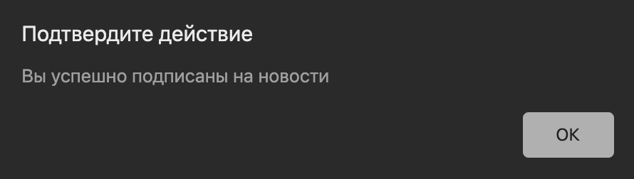
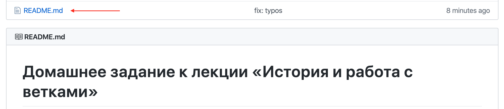
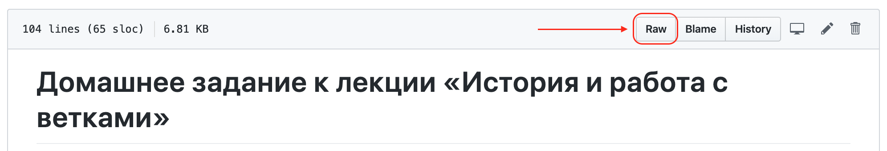

# Домашнее задание к лекции «История и работа с ветками»

## Задача №1 - Работа с историей и переключение между коммитами

### Легенда

Проект NeuroStartUp всё больше развивается и всё больше разработчиков подключается к проекту. Лендинг постоянно оптимизируется под маркетинговые кампании и запросы. Но тут выясняется, что перестала работать функция «Подписаться на новости», а это достаточно важная функция. Вы знаете лишь, что эта функция работала в коммите `c2e06a`, а когда она перестала работать - никто не знает.

Вам нужно найти в каком из коммитов эта функция сломалась и кто её сломал (чтобы он потом починил :smiley:).

### Задача

1. Склонируйте Git-репозиторий [по ссылке](https://github.com/netology-code/git-homeworks-neuro-broken);
1. Переключитесь на коммит `c2e06a`, удостоверьтесь, что функция работает*;
1. Переключитесь на последний коммит;
1. Используя команды переключения между коммитами, определите в каком коммите и кем была внесена ошибка. После переключения между коммитами обновляйте открытый в браузере файл `index.html`.

*Примечание:\* чтобы проверить, что функция работает, нужно открыть в браузере файл `index.html` (просто два раза кликните на этом файле в файловом менеджере), ввести в поле ввода подписки адрес электронной почты и нажать кнопку. В коммите `c2e06a` форма работает, после отправки формы появляется окошко с текстом.*

Окошко с текстом будет выглядеть примерно вот так (если у вас тёмная тема оформления браузера):


**В качестве результата пришлите проверяющему Имя автора коммита и хэш коммита**

## Задача №2 - Создание веток

### Легенда

Вам поставили важную задачу — необходимо написать документацию по встраиванию NeuroStartUp в другие-сервисы (и приложения). Скопируйте код из **Приложения №1** и вставьте его в файл `README.md`.

Вы прекрасно понимаете, что для разработки новых функций необходимо использовать ветки (branches), поэтому ваша задача - создать новую ветку и в ней произвести все изменения.

### Задача

1. Возьмите ваш репозиторий из [задачи 1.1](../introduction#задача-1---демонстрация);
1. Создайте ветку **feature/code-documentation** и переключитесь на неё;
1. Вставьте код в файл README.md;
1. Создайте отдельный репозиторий на GitHub'е;
1. Добавьте `remote target` в свой локальный репозиторий и отправьте сделанные вами изменения на GitHub;
1. Убедитесь, что ветка **feature/code-documentation** тоже попала на GitHub. В итоге в вашем проекте должно получиться две ветки.

<details>
<summary>Приложение №1</summary>
Скопируйте и вставьте в файл README.md всё что находится ниже черты:

-------------

Вы можете встроить NeuroStartUp в ваши приложения с помощью следующих сниппетов (кусочков) кода.

JavaScript:
```javascript
<script src="https://localhost/neuro.sdk.min.js"></script>
```

Java (Maven):
```xml
<dependency>
  <groupId>neuro</groupId>
  <artifactId>sdk</artifactId>
  <version>1.0.0</version>
</dependency>
```

iOS (добавьте код в ваш Podfile):
```
platform :ios, '8.0'
pod "neuro-ios-sdk"
```

---------------

Конец текста для вставки

</details>

<details>
<summary>Подсказка</summary>

Вы можете посмотреть на то, как мы оформили код следующим образом:

1. Кликните на файл `README.md` в верхней части страницы:


2. Кликните на кнопку `raw` в верхней правой части страницы:


</details>

**В качестве результата пришлите проверяющему ссылку на ваш GitHub проект**

#### Справка: разметка блока кода

В языке разметки Markdown блоки кода обозначаются тремя апострафами 

\`\`\` 

<блок кода> 

\`\`\`

## Задача №3 - Слияние изменений

### Легенда

Поскольку разработка новых функций в ветках — ключевой подход при работе с Git'ом, то ваши коллеги также разрабатывают функции в новых ветках. Один из ваших коллег попросил помочь ему со слиянием тех изменений, которые он сделал в ветку **master**. Помогите ему.

### Задача

1. Склонируйте Git-репозиторий [по ссылке](https://github.com/netology-code/git-homeworks-neuro-merge/tree/master) ;
1. Слейте ветку **origin/feature/earlyorder** с веткой **master** (не забудьте разрешить конфликт);
1. Создайте отдельный репозиторий на GitHub'е;
1. Добавьте `remote target` в свой локальный репозиторий и отправьте сделанные вами изменения на GitHub.

**В качестве результата пришлите проверяющему ссылку на ваш GitHub проект**


#### Справка: Клонирование

Обратите внимание, что при клонировании репозитория с удалённого сервера Git автоматически создаёт удалённую ветку `origin/master` и локальную `master`.

Для всех остальных удалённых веток локальные ветки не создаются их нужно создавать с помощью команды: `git branch <local-branch> <origin/remote-branch>`.

Посмотреть все ветки, включая удалённые, вы можете командой: `git branch -a`.

-----------

Все задачи обязательны к выполнению. Присылать на проверку можно только сразу все три задачи.

Любые вопросы по решению задач задавайте в канале курса в Slack.
