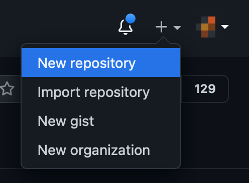
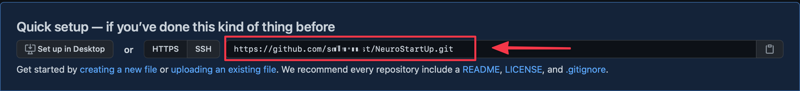
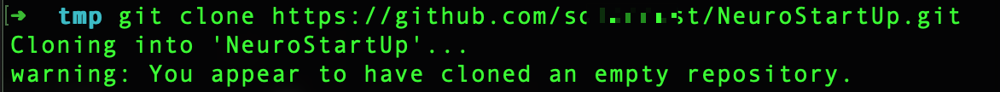
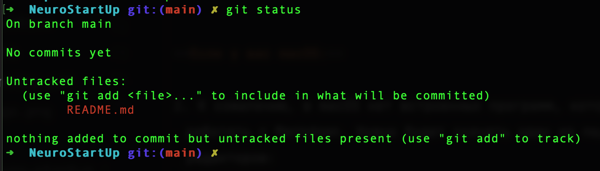
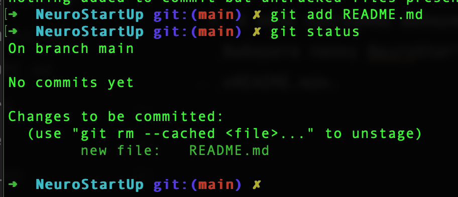
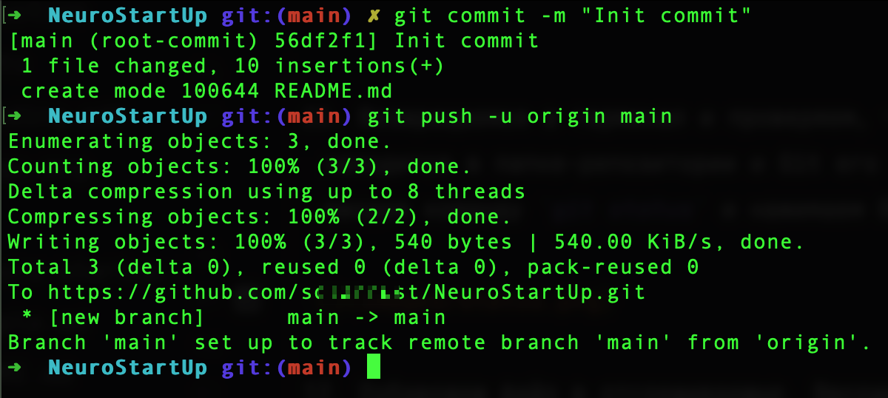
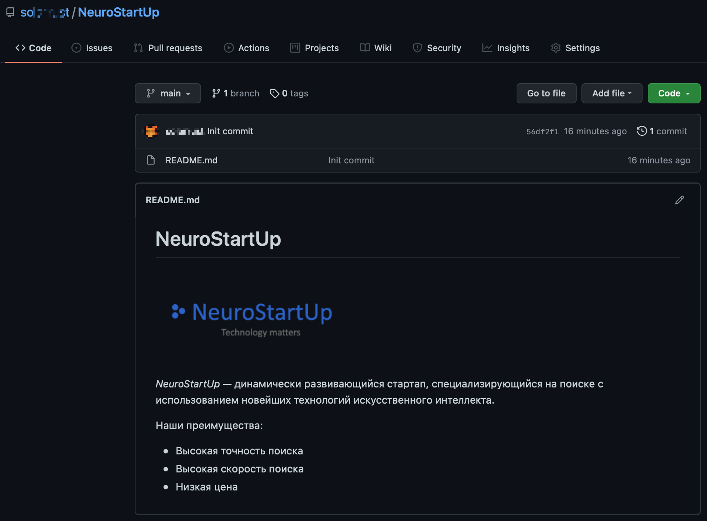

# Инструкция по выполнению самостоятельного задания «Создание репозитория на Github»

Перед решением этой задачи вам нужно [зарегистрироваться на сайте GitHub](https://github.com/netology-code/guides/tree/master/github) и [установить Git](https://github.com/netology-code/guides/tree/master/git) на ваш компьютер.

1. Открываем сайт [github.com](https://github.com). 
2. Нажмите на + в правом верхнем углу рядом с вашей аватаркой и выберите пункт «New repository»:



3. В поле «Repository name» введите название нового репозитория. Например, «NeuroStartUp».
4. Убедитесь, что стоит галочка напротив пункта «Public» чтобы ваш репозиторий был доступен для просмотра другим людям.
5. Нажмите кнопку «Create repository».
6. На появившейся странице скопируйте ссылку на только что созданный репозиторий:



7. Откройте командную строку (терминал) в той папке, в которой вы будете хранить домашнее задание на вашем компьютере.
8. Наберите в командной строке команду

```
git clone ссылка-на-репозиторий
```

и нажмите Enter:



9. После клонирования на вашем компьютере появилась новая папка с названием «NeuroStartUp». Чтобы продолжить работу нужно в неё перейти. Наберите команду `cd NeuroStartUp/` и нажмите Enter.
10. Создадим файл с описанием нашего проекта. 

---

**Если у вас Windows:** 
    
1. Откройте Блокнот, вставьте в него текст примера 
2. В меню программы выберите Файл → Сохранить как…. Выберите папку NeuroStartUp и в качестве имени файла введите «README.md». В поле «Тип файла» нажмите на стрелочку и выберите «Все файлы (*.*)».

---

**Если у вас macOS:**

1. К сожалению, в macOS нет встроенных программ, которые умеют работать с Markdown. Нужно будет скачать один из подходящих редакторов:
- Если вам не потребуется работать с кодом дальше в профессии очень простой [TextMate](https://macromates.com)
- Если планируете работать с кодом, то редактор кода [VS Code](https://code.visualstudio.com)
2. Создайте новый файл в выбранном редакторе. Вставьте в него текст примера.
3. В меню программы выберите Файл → Сохранить… или File → Save… Выберите папку NeuroStartUp, и в качестве имени файла введите «README.md».

---

**Если у вас Linux/Unix:**

1. В Linux системах нет встроенных редакторов с поддержкой Markdown. Для работы нужно будет скачать один из подходящих редакторов:
- Если вам не потребуется работать с кодом в профессии, то обратите свое внимание на следующие редакторы: [Atom](https://atom.io/), [Remarkable](https://remarkableapp.github.io/linux.html)
- Если планируете работать с кодом, то подойдет любой редактор кода который вы используете в Linux. Например: [VS Code](https://code.visualstudio.com)
2. Создайте новый файл в выбранном редакторе. Вставьте в него текст примера.
3. В меню программы выберите Файл → Сохранить… или File → Save… Выберите папку NeuroStartUp, и в качестве имени файла введите «README.md».

---

11. Возвращаемся в терминал и проверяем, что файл ридми находится в папке-репозитории и Git его видит. Для этого вводим команду `git status` и нажимаем Enter.



12. Добавляем файл в отслеживаемые. Вводим команду `git add README.md` и нажимаем Enter. Для надёжности можем ещё раз проверить статус файла. Он должен стать зелёным:



13. Файл готов к коммиту! Вводим команду `git commit -m "Init commit"`. Флаг `-m` позволит нам сразу подписать коммит, без открытия текстового редактора. В кавычках пишем подпись коммита.
14. Теперь можно отправлять файл в удалённый репозиторий на GitHub. Вводим команду `git push -u origin main`. `origin` указывает в какой репозиторий мы отправляем файл, а `main` указывает в какую ветку отправляем изменения.



_При отправке файла в удалённый репозиторий могут быть запрошены авторизационные данные. Вводите логин и личный токен. Обратите внимание, что важно вводить логин с большими и маленькими буквами. При вставке токена в командной строке ничего не будет видно. Это нормально и сделано в целях безопасности._

15. Открываем браузер с сайтом GitHub и созданным в самом начале репозиторием. Перезагружаем страницу. Если всё сделано верно, то вы сразу увидите README.md в списке файлов и ниже текст этого файла:



[Репозиторий-образец](https://github.com/netology-code/NeuroStartUp)

Удачи в дальнейшем обучении 👍
